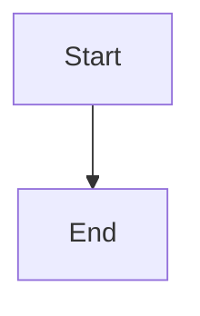
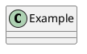

# Documint

Documint は、Markdown ファイルから整った Web ページを公開するための、小規模な PHP 製静的サイトジェネレーターです。

プロジェクトディレクトリ内の Markdown ファイルを走査して HTML に変換し、テンプレートを適用します。また、ページ一覧、カテゴリーページ、サイトマップなどの補助ページも生成します。

English: [README.md](README.md)

## 機能

- Markdown ファイルを HTML ページに変換します。
- `{{title}}`、`{{body}}`、`{{sidebar}}` を使用して `template.html` を適用します。
- 現在のディレクトリまたは親ディレクトリから `sidebar.md` を探索します。
- `_page_list/index.html` を自動生成します。
- ページにカテゴリーを割り当て、カテゴリー別の一覧ページを生成します。
- フェンスコードブロックから Mermaid と PlantUML の図を描画します。
- `{{html}} ... {{/html}}` を使用して生の HTML を明示的に埋め込みます。
- `.md` ファイルへのリンクを、生成された `.html` ファイルへのリンクに書き換えます。

## はじめに

Markdown ファイルを `_documint` ディレクトリと同じ階層に配置し、PHP Web サーバー経由で `_documint/index.php` を開きます。

ローカルで開発する場合:

```powershell
php -S localhost:8000 -t .
```

次の URL を開きます。

```text
http://localhost:8000/_documint/index.php
```

Documint は Markdown ファイルと同じ場所に `.html` ファイルを生成し、さらに次のファイルも生成します。

- `_page_list/index.html`
- `_page_list/category-*.html`
- `sitemap.xml`

ページを生成する前に `_documint/config.php` を作成し、生成用の ID とパスワードを設定します。

```php
<?php
define('DOCUMINT_AUTH_ID', 'admin');
define('DOCUMINT_AUTH_PASSWORD', 'password');
```

CI などのコマンドライン環境から実行する場合は、`--id`、`--password`、`--mode` を渡して認証し、生成モードを選択します。

```bash
php _documint/index.php --id=admin --password=password --mode=site
php _documint/index.php --id=admin --password=password --mode=readme-index
```

ブラウザーから正しいIDとパスワードで生成すると、認証状態はログイン時点から1時間維持されます。その間は生成のたびにIDとパスワードを再入力する必要はありません。共有端末では、作業後に画面の「ログアウト」を押してください。CLI実行ではセッションを使用せず、従来どおり実行ごとに認証情報が必要です。

`--mode=site` では、各 Markdown ファイルと同じ名前の HTML ファイルを生成します。`--mode=readme-index` では、それ以外の Markdown ファイルは通常どおり生成しつつ、すべての `README.md` を同じディレクトリの `README.html` ではなく `index.html` として生成します。`README.md` と `index.md` が同じディレクトリにある場合、どちらも `index.html` を生成するためエラーになります。サイトマップの URL に CI 固有の値が必要な場合は、`--root-url` と `--base-path` も指定できます。コマンドラインで渡したパスワードはシェル履歴に残る場合があるため注意してください。

CLI 実行は成功すると終了ステータス `0` を返します。生成エラーが発生した場合は、復旧可能な生成処理を完了した後、エラーを標準エラー出力へ書き込み、終了ステータス `1` で終了します。

```bash
php _documint/index.php --id=admin --password=password --mode=site --root-url=https://example.com --base-path=docs
```

チュートリアルは [docs/README.md](docs/README.md) を参照してください。

## テンプレートタグ

HTML テンプレートでは、次のプレースホルダーを使用できます。

```text
{{title}}
{{body}}
{{sidebar}}
```

- `{{title}}` はページタイトルに置き換えられます。
- `{{body}}` は変換された Markdown 本文に置き換えられます。
- `{{sidebar}}` は変換された `sidebar.md` の内容に置き換えられます。

## Markdown タグ

### ページタイトル

`{{title Page Title}}` を使用すると、ページタイトルを明示的に設定できます。

```text
{{title Getting Started}}
```

この指定は、Markdown ファイル内の最初の `# Heading` より優先されます。

### カテゴリー

`{{category ...}}` を使用すると、ページに1つ以上のカテゴリーを割り当て、生成されたカテゴリーページへのリンクを出力できます。

```text
{{category Guide, Reference}}
```

複数のカテゴリーはカンマで区切ります。

カテゴリーページは `_page_list/category-{hash}.html` に生成されます。

### カテゴリー一覧

`{{category_list}}` を使用すると、すべてのカテゴリーについて、カテゴリーごとにまとめたページ一覧を出力できます。

```text
{{category_list}}
```

カテゴリーを絞り込むこともできます。

```text
{{category_list Guide}}
{{category_list Guide, Reference}}
```

見出しレベルも選択できます。

```text
{{category_list size=3}}
{{category_list size=3, Guide, Reference}}
```

見出しレベルには `1` から `6` までを指定できます。

### ページ一覧

`{{page_list}}` を使用すると、検出されたすべての Markdown ページへのリンクを出力できます。

```text
{{page_list}}
```

Documint は `_page_list/index.html` にも全ページの一覧を生成します。

### ファイルのインクルード

三重波括弧を使用すると、別のファイルをインクルードできます。

```text
{{{ filename }}}
```

- `.pu` ファイルは PlantUML として描画されます。
- `.html` と `.htm` ファイルは HTML 断片としてインクルードされます。
- その他のファイルは Markdown としてインクルードされます。

### 生の HTML ブロック

Markdown ページ内へ生の HTML を直接記述する場合は、`{{html}} ... {{/html}}` を使用します。

```text
{{html}}
<div class="alert alert-info">This HTML is emitted as-is.</div>
{{/html}}
```

HTML ブロック内では、Markdown と Documint のタグは解釈されません。

## 図とコード

Documint は次のフェンスコードブロックをサポートします。

````text




```source
<p>This source block is emitted directly.</p>
```
````

また、`@startuml` で始まり `@enduml` で終わる PlantUML ブロックもサポートします。

## 謝辞

Documint は PHP Markdown パーサーとして [Parsedown](https://github.com/erusev/parsedown) を使用しています。
