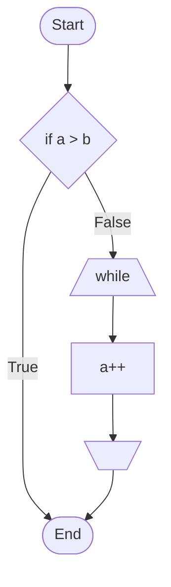

# テスト



```plantuml
Interface InterfaceA {
}

class ClassA {
}

InterfaceA <|.. ClassA
```

```cpp
int main(int argc, char* argv[])
{
  return 0;
}
```

## 記事 予約語
* `{{page_list}}`
```source
* `{{{ filename }}}`
* ````source"`
```

## template 予約語
* `{{title}}`
* `{{body}}`
* `{{sidebar}}`
