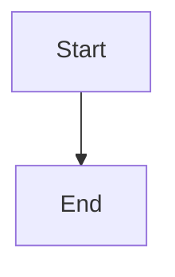
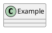

# Documint

Documint is a small PHP-based static site generator for publishing clean web pages from Markdown files.

It scans Markdown files in the project directory, converts them to HTML, applies a template, and generates supporting pages such as a page list, category pages, and a sitemap.

Japanese: [README.ja.md](README.ja.md)

## Features

- Convert Markdown files to HTML pages.
- Apply `template.html` with `{{title}}`, `{{body}}`, and `{{sidebar}}`.
- Resolve `sidebar.md` from the current directory or a parent directory.
- Generate `_page_list/page_list.html` automatically.
- Assign categories to pages and generate category index pages.
- Render Mermaid and PlantUML diagrams from fenced code blocks.
- Embed raw HTML explicitly with `{{html}} ... {{/html}}`.
- Rewrite links to `.md` files so they point to generated `.html` files.

## Getting Started

Place your Markdown files next to the `_documint` directory, then open `_documint/index.php` through a PHP web server.

For local development:

```powershell
php -S localhost:8000 -t .
```

Then open:

```text
http://localhost:8000/_documint/index.php
```

Documint will generate `.html` files beside your Markdown files, plus:

- `_page_list/page_list.html`
- `_page_list/category-*.html`
- `sitemap.xml`

Before generating pages, create `_documint/config.php` and set the generation ID and password:

```php
<?php
define('DOCUMINT_AUTH_ID', 'admin');
define('DOCUMINT_AUTH_PASSWORD', 'password');
```

When running from CI or another command-line environment, pass `--id`, `--password`, and `--mode` to authenticate and choose the generation mode:

```bash
php _documint/index.php --id=admin --password=password --mode=site
php _documint/index.php --id=admin --password=password --mode=readme-index
```

Use `--mode=site` to generate each Markdown file as a same-named HTML file. Use `--mode=readme-index` to generate every `README.md` as `index.html` in the same directory instead of `README.html`, while generating all other Markdown files normally. A directory containing both `README.md` and `index.md` is rejected because both would produce `index.html`. You can also pass `--root-url` and `--base-path` when sitemap URLs need CI-specific values. Be careful when passing passwords on the command line because they may be saved in shell history.

CLI runs exit with status `0` on success. If any generation error occurs, the error is written to standard error and the process exits with status `1` after completing any recoverable generation work.

```bash
php _documint/index.php --id=admin --password=password --mode=site --root-url=https://example.com --base-path=docs
```

See the tutorial in [docs/README.md](docs/README.md).

## Template Tags

The HTML template can use these placeholders:

```text
{{title}}
{{body}}
{{sidebar}}
```

- `{{title}}` is replaced with the page title.
- `{{body}}` is replaced with the converted Markdown body.
- `{{sidebar}}` is replaced with the converted `sidebar.md` content.

## Markdown Tags

### Page Title

Use `{{title Page Title}}` to set the page title explicitly.

```text
{{title Getting Started}}
```

This takes priority over the first `# Heading` in the Markdown file.

### Categories

Use `{{category ...}}` to assign one or more categories to a page and output links to the generated category pages.

```text
{{category Guide, Reference}}
```

Multiple categories are separated with commas.

Category pages are generated under `_page_list/category-{hash}.html`.

### Category Lists

Use `{{category_list}}` to output grouped page lists for all categories.

```text
{{category_list}}
```

You can filter categories:

```text
{{category_list Guide}}
{{category_list Guide, Reference}}
```

You can also choose the heading level:

```text
{{category_list size=3}}
{{category_list size=3, Guide, Reference}}
```

The heading level can be `1` through `6`.

### Page List

Use `{{page_list}}` to output links to all discovered Markdown pages.

```text
{{page_list}}
```

Documint also generates the full page list at `_page_list/page_list.html`.

### Include Files

Use triple braces to include another file:

```text
{{{ filename }}}
```

- `.pu` files are rendered as PlantUML.
- `.html` and `.htm` files are included as HTML fragments.
- Other files are included as Markdown.

### Raw HTML Blocks

Use `{{html}} ... {{/html}}` when you want to write raw HTML directly in a Markdown page.

```text
{{html}}
<div class="alert alert-info">This HTML is emitted as-is.</div>
{{/html}}
```

Inside an HTML block, Markdown and Documint tags are not interpreted.

## Diagrams and Code

Documint supports these fenced blocks:

````text




```source
<p>This source block is emitted directly.</p>
```
````

It also supports PlantUML blocks that start with `@startuml` and end with `@enduml`.

## Acknowledgements

Documint uses [Parsedown](https://github.com/erusev/parsedown) as its PHP Markdown parser.
