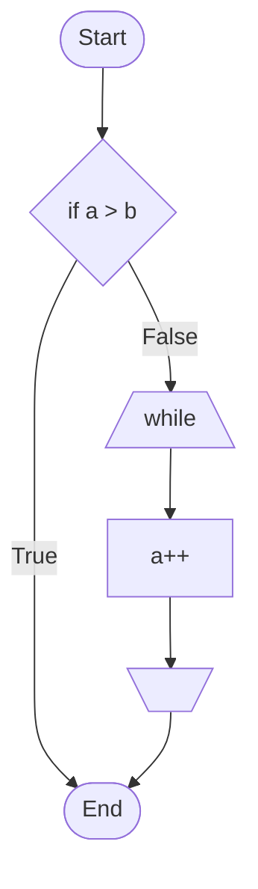

# Documint
MarkdownからスッキリとしたWebページをサクッと発行


## テンプレート内で使用できるタグ
`{{title}}`
`{{body}}`
`{{sidebar}}`
`{{category カテゴリ名,...}}`
`{{category_list カテゴリ名}}`

### category / category_list
- `{{category カテゴリ名}}` でページにカテゴリを設定。複数カテゴリは `,` 区切りで指定。
- `{{category_list}}` はカテゴリごとに `<h2>カテゴリ名</h2>` + ページリストを生成。
- `{{category_list カテゴリ名}}` は指定カテゴリのページだけを生成。
- `{{category_list カテゴリ名1,カテゴリ名2}}` のような複数指定は無視。

## サイドバー
- サイドバーは `sidebar.md` を親ディレクトリに向かって探索して使用します。
- `sidebar.md` は Markdown として処理され、`template.html` 内の `{{sidebar}}` に埋め込まれます。

## Markdown内で使用できる機能
`{{{ filename }}}` と記述すると`filename`で指定したファイルをマージします。
拡張子が`.pu`の場合はPlantUMLとして処理
拡張子が`.html`の場合はHTMLとして処理
それ以外の拡張子ではMarkdownとしてマージします。

"```source"
"```mermaid"
"```plantuml"
`{{page_list}}`
"@startuml"

# テスト



```plantuml
Interface InterfaceA {
}

class ClassA {
}

InterfaceA <|.. ClassA
```

```cpp
int main(int argc, char* argv[])
{
  return 0;
}
```

# 謝辞
PHPのMarkdownパーサーに[parsedown](https://github.com/erusev/parsedown)を利用しています。
