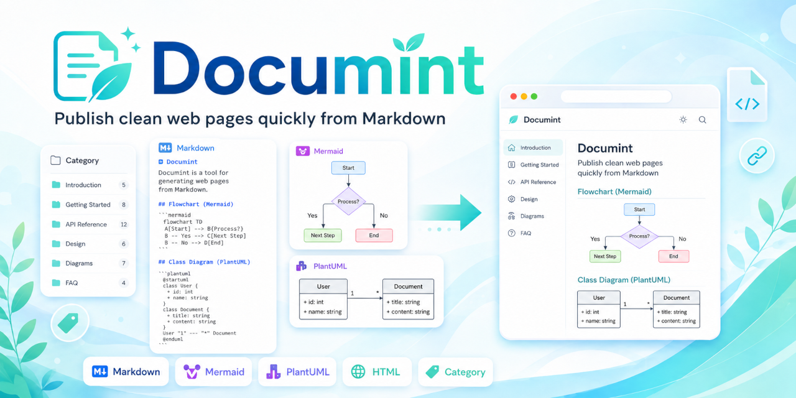

{{title Documint}}



# Documint

Documint is a small PHP-based static site generator for teams that want to publish Markdown as clean HTML pages.

It is designed for documentation that starts small but needs to stay findable: project notes, onboarding guides, operation manuals, feature references, and team knowledge bases.

## Source on GitHub

This documentation is both the source and the demo: Markdown files in GitHub are generated into the pages you are reading now.

- [View the GitHub repository](https://github.com/shun126/Documint)
- [View this page source](https://github.com/shun126/Documint/blob/main/docs/README.md)

## Why Documint?

- Write pages in ordinary Markdown.
- Generate HTML pages with a shared template and sidebar.
- Publish the generated site with GitHub Pages.
- Organize the same page through multiple categories.
- Use categories not only as topics, but also as audience, importance, owner, or author signatures.

## Categories as a Matrix

Documint lets one page belong to several categories at the same time.

For example, a page can be marked as required reading, aimed at engineers, and signed by its owner:

```text
{{category Required, Engineer, Moriya}}
```

That single page can then be found from different viewpoints:

- `Required`: important pages everyone should read.
- `Engineer`: pages for engineers.
- `Moriya`: pages written, owned, or maintained by Moriya.

This is useful when a document should not live in only one folder-like location. A release note can be both `Required` and `Engineer`; an operations guide can be both `Operations` and `Moriya`.

## Start Small

Create a Markdown file, open `_documint/index.php` through a PHP server, and Documint generates a matching HTML file.

```text
docs/README.md -> docs/index.html
```

The generated site also includes page lists, category pages, and a sitemap.

## Explore the Examples

- [Markdown Basics](markdown-basics.md): a small Markdown page example.
- [Category Workflow](category-workflow.md): how to use categories as topic, audience, importance, and signature.
- [Feature Reference](feature-reference.md): detailed Documint syntax examples and generation checks.
- [Advanced Features](advanced-features.md): diagrams, source blocks, and raw HTML examples.

{{category Required, ProductOverview, Moriya}}
