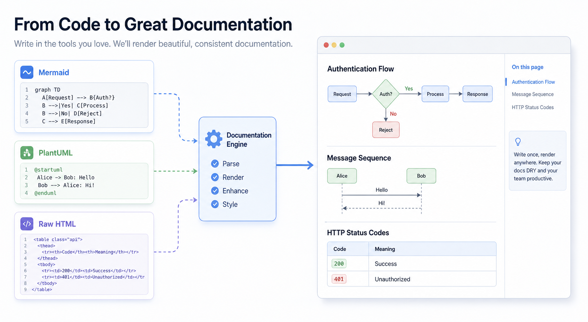
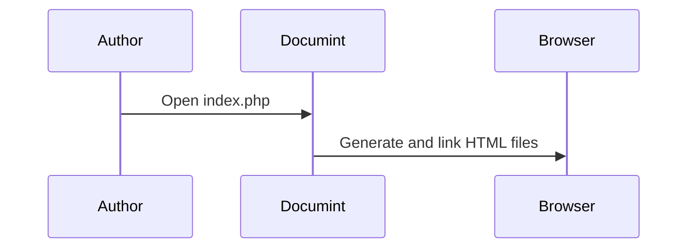
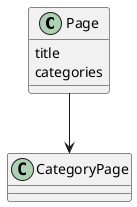

{{title Advanced Features}}

# Advanced Features



This page provides focused examples for Documint-specific syntax.

## Mermaid



## PlantUML



## Source Block

```source
<p>This content is emitted directly from a source block.</p>
```

```cpp
void main()
{
  printf("Hellow world");
}
```

## Raw HTML Block

{{html}}
<div class="alert alert-warning">
  Raw HTML blocks are useful for one-off Bootstrap components.
</div>
{{/html}}

## Category Links
{{category_list size=3}}

----
{{category Reference, Guide, Moriya}}
