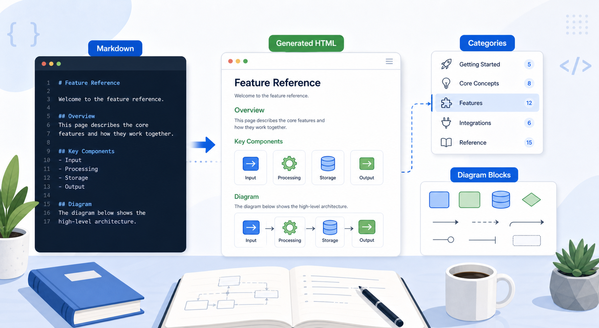
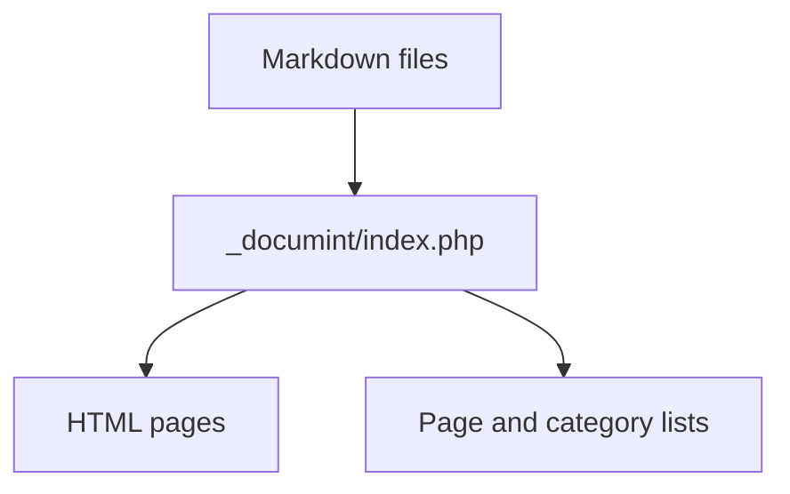
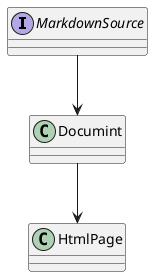

{{title Feature Reference}}

# Feature Reference



This page is a working reference for Documint-specific syntax. It is intentionally detailed so it can also be used as a generation check.

## Page Title

Use `{{title ...}}` to set the generated HTML title and page-list title.

```text
{{title Feature Reference}}
```

If the title tag is omitted, Documint uses the first `# Heading`.

## Categories

Use `{{category ...}}` to assign one or more categories and print links to the generated category pages.

```text
{{category Reference, GenerationCheck, Moriya}}
```

Categories can describe topic, audience, importance, owner, or author signature.

{{category Reference, GenerationCheck, Moriya}}

## Category Lists

Use `{{category_list}}` to show all category groups:

{{category_list size=3}}

You can also filter to specific categories:

{{category_list size=3, Required, Reference, Moriya}}

## Page List

Use `{{page_list}}` to show every Markdown page discovered by Documint:

{{page_list}}

Documint also generates the full list at `_page_list/page_list.html`.

## Sidebar

The sidebar is loaded from the nearest `sidebar.md`. This site includes `docs/sidebar.md`, so pages under `docs/` use that sidebar.

## Mermaid



## PlantUML



## Code

```php
<?php
echo "Hello from Documint";
```

## Raw HTML

Use `{{html}} ... {{/html}}` for raw HTML that should be emitted as-is.

{{html}}
<div class="alert alert-info">
  This block is raw HTML inside a Markdown page.
</div>
{{/html}}
