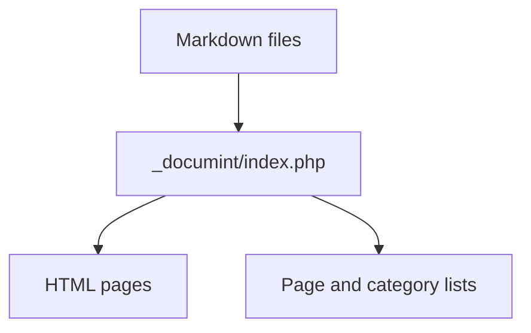
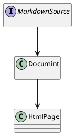

{{title Documint Tutorial}}
{{category Tutorial, Guide}}

# Documint Tutorial

This page is both a tutorial and a working example. Open `_documint/index.php` through a PHP server and Documint will generate `docs/index.html` from this file.

## 1. Write Markdown

Create `.md` files anywhere outside directories that start with `_` or `.`. Documint scans those files and generates matching `.html` files.

For example, this file becomes:

```text
docs/index.html
```

## 2. Set a Page Title

The first line of this file uses:

```text
{{title Documint Tutorial}}
```

That title is used for the generated HTML `<title>` and for page lists. If `{{title ...}}` is omitted, Documint uses the first `# Heading`.

## 3. Add Categories

This page uses:

```text
{{category Tutorial, Guide}}
```

Documint records the categories and also prints links to the generated category pages here:

{{category Tutorial, Guide}}

## 4. Show Category Lists

Use `{{category_list}}` to show all category groups:

{{category_list size=3}}

You can also filter to specific categories:

{{category_list size=3, Tutorial, Reference}}

## 5. Show All Pages

Use `{{page_list}}` to show every Markdown page discovered by Documint:

{{page_list}}

Documint also generates the full list at `_page_list/page_list.html`.

## 6. Use the Sidebar

The sidebar is loaded from the nearest `sidebar.md`. This tutorial includes `docs/sidebar.md`, so pages under `docs/` use that sidebar.

## 7. Render Mermaid



## 8. Render PlantUML



## 9. Render Code

```php
<?php
echo "Hello from Documint";
```

## 10. Use Raw HTML

Use `{{html}} ... {{/html}}` for raw HTML that should be emitted as-is.

{{html}}
<div class="alert alert-info">
  This block is raw HTML inside a Markdown page.
</div>
{{/html}}

## Next Steps

Read [Markdown Basics](markdown-basics.md) for a smaller content page and [Advanced Features](advanced-features.md) for diagram and raw HTML examples.
