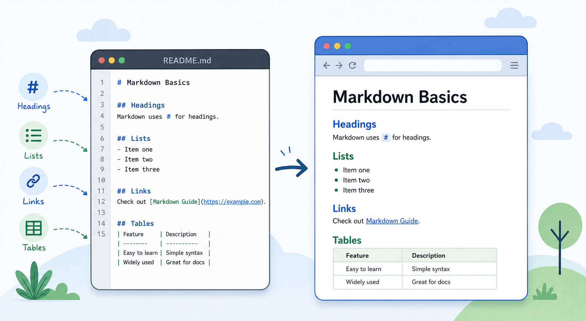

{{title Markdown Basics}}

# Markdown Basics

This page demonstrates a small documentation page written in ordinary Markdown.

## Headings and Text

Use headings to divide the page into sections. Paragraphs are written as plain text.

## Lists

- Write Markdown files.
- Open `_documint/index.php`.
- Review the generated HTML.

## Tables

| Input | Output |
| --- | --- |
| `docs/markdown-basics.md` | `docs/markdown-basics.html` |
| `README.md` | `README.html` |

## Links

Links to Markdown files are rewritten to generated HTML paths.

Go back to [Documint](index.md).

{{category Tutorial, GettingStarted, Moriya}}
